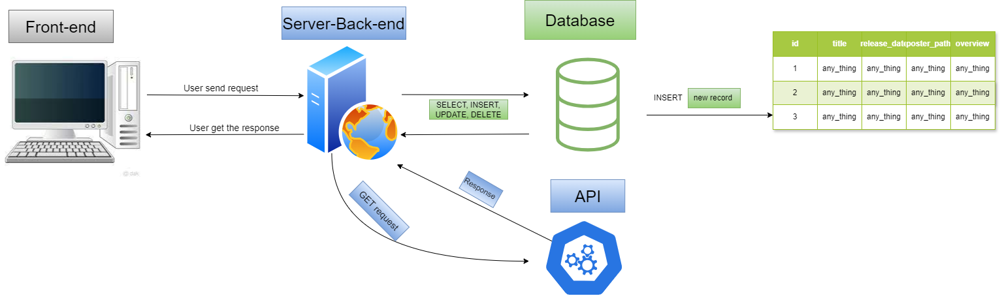

# Movies-Library

**Author Name**: Fadi Al-Najar

## WRRC
**Image of WRRC** :


## Overview
In today's lab, I Add more Routes.

## Getting Started
<!-- What are the steps that a user must take in order to build this app on their own machine and get it running? -->
1. Creating the three routs:
```js
app.delete("/DELETE/:id", handleDelete);
app.put("/UPDATE/:id", handleUpdate);
app.get("/getMovie/:id", handleGetMovieID);
```

## Project Features
<!-- What are the features included in you app -->
**There no new Features in today's lab**